# 🏥 Hospital Management System — Microservices Architecture

A full-stack Hospital Management System built with **Spring Boot microservices**, connected via **Eureka Service Discovery** and an **API Gateway**. The system handles user authentication (JWT), doctor staff management, patient medical records, and appointment booking — with **automatic cross-service registration** so that signing up through AuthService creates the corresponding Doctor or Patient profile instantly.

---

## 📑 Table of Contents

- [Architecture Overview](#-architecture-overview)
- [Tech Stack](#️-tech-stack)
- [Backend Architecture](#-backend-architecture-deep-dive)
- [Frontend Architecture](#️-frontend-architecture)
- [Microservices](#-microservices)
- [Database Schema & Relationships](#️-database-schema--relationships)
- [API Workings — Request Lifecycle](#-api-workings--request-lifecycle)
- [Database Connection Strategy](#-database-connection-strategy)
- [Getting Started](#-getting-started)
- [Swagger UI](#-swagger-ui-api-documentation)
- [End-to-End System Workflow](#-end-to-end-system-workflow)
- [Project Structure](#️-project-structure)
- [Port Summary](#️-port-summary)
- [Contributing](#-contributing)

---

## 📐 Architecture Overview

```
                         ┌──────────────────┐
                         │   Eureka Server   │
                         │    (Port 8761)    │
                         └────────┬─────────┘
                                  │ Service Registry
          ┌───────────────────────┼───────────────────────┐
          │                       │                       │
          ▼                       ▼                       ▼
 ┌─────────────────┐   ┌─────────────────┐   ┌─────────────────┐   ┌──────────────────┐
 │   AuthService    │──▶│  DoctorService   │   │ PatientService   │   │AppointmentService│
 │   (Port 8081)    │   │   (Port 8082)    │   │   (Port 8083)    │   │   (Port 8084)    │
 │   JWT + MySQL    │──▶│     MySQL        │   │     MySQL        │   │  Feign + MySQL   │
 └────────┬─────────┘   └────────┬─────────┘   └────────┬─────────┘   └────────┬─────────┘
          │                       │                       │                       │
          └───────────────────────┼───────────────────────┼───────────────────────┘
                                  │ lb:// (Load Balanced)
                         ┌────────┴─────────┐
                         │   API Gateway     │
                         │    (Port 8080)    │
                         └────────┬─────────┘
                                  │
                         ┌────────┴─────────┐
                         │  Frontend SPA /   │
                         │  Client / Postman │
                         └──────────────────┘
```

> **Inter-service calls**: AuthService uses a **load-balanced RestClient** (via Eureka) to call DoctorService or PatientService during registration, automatically creating the domain profile. AppointmentService uses **OpenFeign** clients to resolve doctor/patient data.

---

## 🛠️ Tech Stack

| Technology | Purpose |
|------------|---------|
| **Spring Boot 3.x** | Core framework for all microservices |
| **Spring Cloud 2025.0.0** | Microservice infrastructure (Eureka, Gateway) |
| **Spring Cloud Gateway** | API Gateway with WebFlux for routing |
| **Netflix Eureka** | Service discovery and registration |
| **Spring Security + JWT** | Authentication and authorization |
| **Spring Data JPA + Hibernate** | ORM for database operations with DDL auto-generation |
| **OpenFeign** | Declarative inter-service REST client (AppointmentService) |
| **MySQL 8.x** | Shared relational database |
| **Lombok** | Reduce boilerplate code |
| **SpringDoc OpenAPI** | Swagger UI for API documentation |
| **Maven** | Build and dependency management |
| **HTML5 & CSS3** | Client structure & styling with Glassmorphism design |
| **Vanilla JS (ES6+)** | Single Page Application logic, routing, and API integration |

---

## 🧱 Backend Architecture Deep-Dive

### Layered Architecture Pattern

Every microservice (AuthService, DoctorService, PatientService, AppointmentService) follows a consistent **layered architecture** pattern. This ensures separation of concerns, testability, and maintainability.

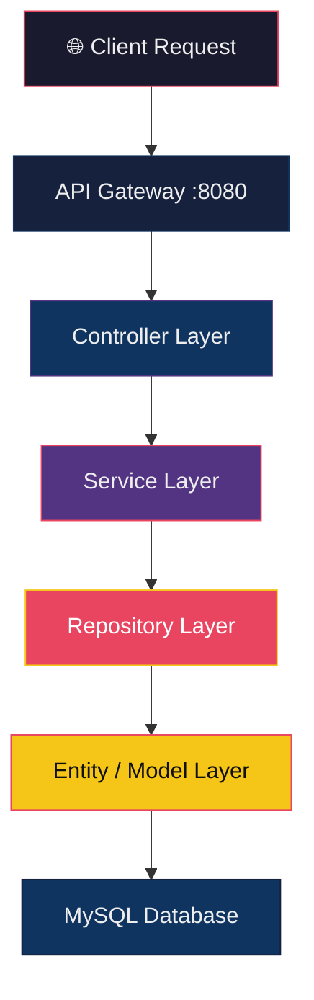

#### Layer Responsibilities

| Layer | Responsibility | Example Classes |
|-------|---------------|-----------------|
| **Controller** | Receives HTTP requests, delegates to Service layer, returns HTTP responses. Contains no business logic. | `DoctorController`, `PatientController`, `AppointmentController`, `AuthController` |
| **Service (Interface)** | Defines the contract for business operations. Enables loose coupling and testability. | `DoctorService`, `PatientService`, `AppointmentService` |
| **Service (Implementation)** | Implements business logic — validation, transformations, orchestration between repositories and external services. | `DoctorServiceImpl`, `PatientServiceImpl`, `AppointmentServiceImpl`, `AuthService` |
| **Repository** | Data access layer using Spring Data JPA. Auto-generates queries from method signatures. | `DoctorRepository`, `PatientRepository`, `AppointmentRepository`, `UserRepository` |
| **Entity** | JPA-annotated POJOs mapped to database tables. Defines column constraints, indexes, and logical FK relationships. | `Doctor`, `Patient`, `Appointment`, `User` |
| **DTO** | Data Transfer Objects — shapes data for API requests/responses without exposing internal entities. | `AppointmentRequest`, `AppointmentResponse`, `DoctorRegisterRequest`, `RegisterRequest`, `LoginRequest` |
| **Mapper** | Converts between Entity and DTO objects. Keeps conversion logic centralized. | `AppointmentMapper` |
| **Exception** | Custom exceptions and global handlers for uniform error responses. | `ResourceNotFoundException`, `AppointmentNotFoundException`, `GlobalExceptionHandler` |

---

### Design Patterns Used

| Pattern | Where Used | Purpose |
|---------|-----------|---------|
| **Service Interface + Implementation** | `DoctorService` / `DoctorServiceImpl`, `PatientService` / `PatientServiceImpl`, `AppointmentService` / `AppointmentServiceImpl` | Loose coupling via abstraction; enables mocking in tests |
| **Repository Pattern** | `JpaRepository` extensions | Abstracts database operations behind a clean interface |
| **DTO Pattern** | `AppointmentRequest` / `AppointmentResponse`, `DoctorRegisterRequest`, `RegisterRequest` | Decouples API contract from database entity structure |
| **Mapper Pattern** | `AppointmentMapper` | Centralizes Entity ↔ DTO conversion logic |
| **Builder Pattern** | `User.builder()` (via Lombok `@Builder`) | Clean object construction for the User entity |
| **Filter Chain Pattern** | `JwtAuthenticationFilter` in Spring Security | Intercepts requests to validate JWT tokens before reaching controllers |
| **API Gateway Pattern** | `ApiGateway` with Spring Cloud Gateway | Single entry point routing, load balancing, and CORS management |
| **Service Registry Pattern** | Netflix Eureka | Dynamic service discovery — services register themselves and locate each other by name |
| **Feign Declarative Client** | `DoctorClient`, `PatientClient` | Inter-service HTTP calls written as simple Java interfaces |

---

### Inter-Service Communication

The system uses two distinct communication strategies:

#### 1. Load-Balanced RestClient (AuthService → Doctor/Patient)

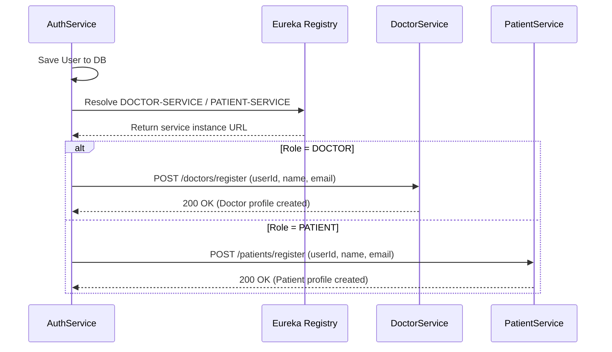

- **Configuration**: `RestClientConfig.java` creates a `@LoadBalanced RestClient.Builder`
- **Discovery**: Uses Eureka logical names (`http://DOCTOR-SERVICE/...`) resolved at runtime
- **Resilience**: If the downstream service is unavailable, the user is still saved and a warning is logged

#### 2. OpenFeign Clients (AppointmentService → Doctor/Patient)

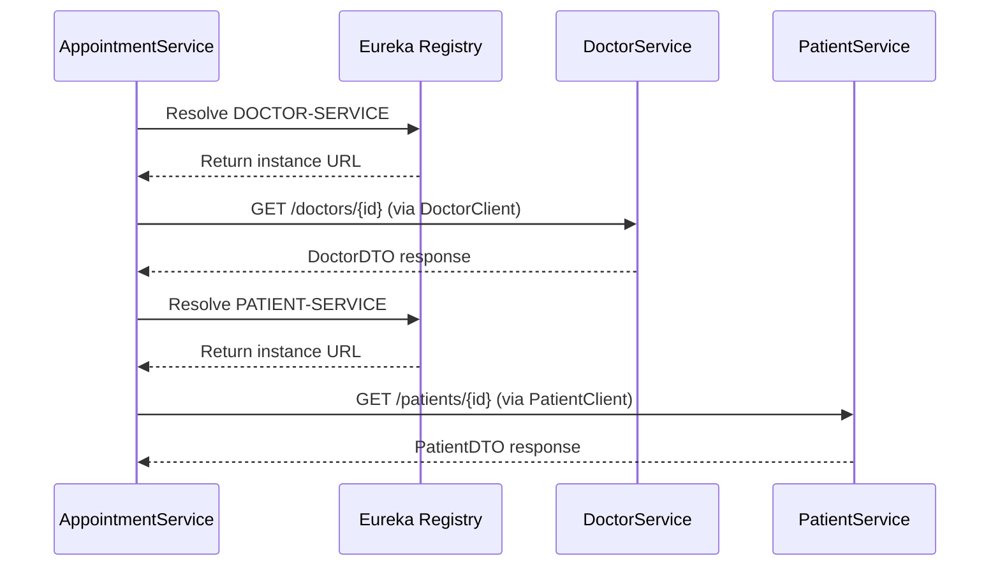

- **DoctorClient**: `@FeignClient(name = "DOCTOR-SERVICE")` — fetches doctor info by ID
- **PatientClient**: `@FeignClient(name = "PATIENT-SERVICE")` — fetches patient info by ID

---

### Security Architecture (AuthService)

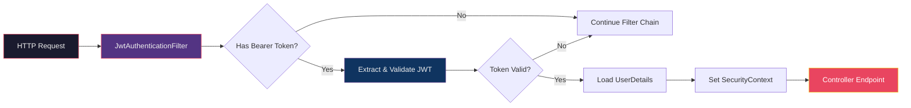

| Component | File | Role |
|-----------|------|------|
| **SecurityConfig** | `SecurityConfig.java` | Configures HTTP security, disables CSRF, sets stateless sessions, defines public/protected routes |
| **JwtAuthenticationFilter** | `JwtAuthenticationFilter.java` | `OncePerRequestFilter` — extracts JWT from `Authorization: Bearer` header, validates, and sets `SecurityContext` |
| **JwtUtil** | `JwtUtil.java` | Token generation (HMAC-SHA) and parsing — embeds user ID, username, role, email in claims |
| **CustomUserDetailsService** | `CustomUserDetailsService.java` | Loads user from DB by email for Spring Security authentication |
| **BCrypt PasswordEncoder** | Configured in `SecurityConfig` | Hashes passwords before storage; verifies on login |

#### JWT Token Structure
```json
{
  "id": 1,
  "username": "Dr. Smith",
  "role": "DOCTOR",
  "sub": "drsmith@hospital.com",
  "iat": 1720540800,
  "exp": 1720627200
}
```
- **Signing Algorithm**: HMAC-SHA (key from `jwt.secret` property)
- **Expiration**: 24 hours (86,400,000 ms — configurable via `jwt.expiration`)

---

## 🖥️ Frontend Architecture

The client application is a responsive, high-performance **Single Page Application (SPA)** written using native web technologies.

```
                  ┌──────────────────────────────────────────────┐
                  │                 index.html                   │
                  │  (Single Page Web Interface / Portal Client)  │
                  └──────────────────────┬───────────────────────┘
                                         │
                        HTTP Requests /  │  localStorage (JWT)
                        REST API Calls   │  hms_token
                                         ▼
                  ┌──────────────────────────────────────────────┐
                  │            API Gateway (Port 8080)           │
                  └──────────────────────────────────────────────┘
```

### SPA Architecture Breakdown

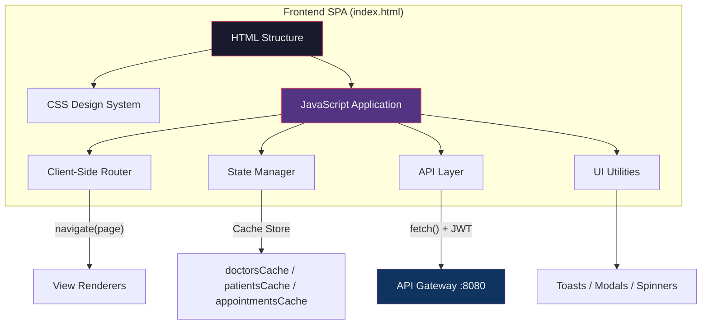

### Key Technical Pillars

| Pillar | Description |
|--------|-------------|
| **Zero-Dependency SPA** | Built entirely with HTML5, CSS3, and ES6+ JavaScript. No bundlers, compilers, or npm packages — fast and lightweight. |
| **Glassmorphism Design** | CSS Variables (`:root`) manage design tokens. Background blur filters, micro-animations, custom scrollbars, and modern typography (Inter, JetBrains Mono). |
| **Client-Side Routing** | `navigate(page)` function handles view switching (Dashboard, My Profile, Book Appointment, My Appointments, Patient Directory) without full page reloads. |
| **In-Memory Cache** | Transient caches (`doctorsCache`, `patientsCache`, `appointmentsCache`, `currentUser`, `myProfile`) minimize redundant API calls. |
| **Toast Notification System** | `toast(message, type)` renders overlay notifications for success, error, and info states. |
| **Responsive Design** | Flexbox/Grid layouts with media queries below `768px` for mobile-first adaptation. Sidebar collapses to mobile navigation. |

### Security & Session Management

| Feature | Implementation |
|---------|---------------|
| **JWT Decoding** | Decodes the signature-less payload to extract `id`, `username`, `role`, `email`, `expiration` |
| **Session Persistence** | Token stored in `localStorage` (`hms_token`); auto-validates expiration to trigger logout |
| **Role-Based Navigation** | Dynamically alters menu items based on `PATIENT` vs `DOCTOR` role |
| **Token Injection** | API helper automatically adds `Authorization: Bearer <token>` header to all fetch requests |

### Frontend ↔ Backend Communication Flow

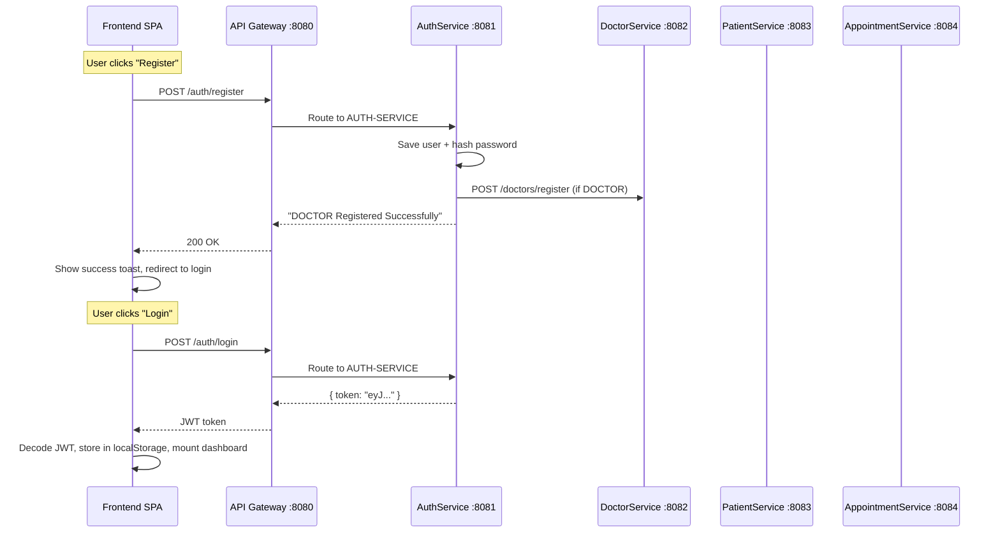

---

## 📦 Microservices

### 1. Eureka Server (`/eureka`) — Port 8761

The **service registry**. All other microservices register themselves here on startup. The API Gateway discovers services through Eureka instead of using hardcoded URLs.

- **Dashboard**: `http://localhost:8761`
- **Role**: Central registry — does NOT handle any business logic
- **Key Annotation**: `@EnableEurekaServer`

---

### 2. API Gateway (`/ApiGateway`) — Port 8080

The **single entry point** for all client requests. Routes traffic to the correct microservice using Eureka-based load balancing (`lb://`).

| Route Pattern | Target Service | Eureka Name |
|---------------|---------------|-------------|
| `/auth/**` | AuthService | `AUTH-SERVICE` |
| `/doctors/**` | DoctorService | `DOCTOR-SERVICE` |
| `/patients/**` | PatientService | `PATIENT-SERVICE` |
| `/appointments/**` | AppointmentService | `APPOINTMENT-SERVICE` |

**CORS Configuration**: The gateway allows all origins (`*`), supports `GET, POST, PUT, DELETE, OPTIONS` methods, and exposes all headers with a 1-hour preflight cache.

> **Why use the Gateway?** Clients only need to know one URL (`localhost:8080`). The Gateway handles routing, and if services scale to multiple instances, it load-balances automatically.

---

### 3. AuthService (`/AuthService`) — Port 8081

Handles **user registration, login, and JWT token generation**. Secured with Spring Security. On registration, **automatically creates a Doctor or Patient profile** in the corresponding downstream service via inter-service REST calls.

#### Endpoints

| Method | Endpoint | Auth Required | Description |
|--------|----------|:------------:|-------------|
| `POST` | `/auth/register` | ❌ | Register a new user (DOCTOR or PATIENT role) — also creates Doctor/Patient profile |
| `POST` | `/auth/login` | ❌ | Login and receive a JWT token |
| `GET` | `/auth/profile` | ✅ Bearer Token | View the logged-in user's profile |

#### Registration Flow

```
POST /auth/register (role=DOCTOR)
  ├─ 1. Save User to `users` table (AuthService)
  ├─ 2. HTTP POST to DOCTOR-SERVICE /doctors/register (via Eureka lb://)
  │     └─ Creates a Doctor record with userId, name, email
  └─ 3. Return "DOCTOR Registered Successfully"

POST /auth/register (role=PATIENT)
  ├─ 1. Save User to `users` table (AuthService)
  ├─ 2. HTTP POST to PATIENT-SERVICE /patients/register (via Eureka lb://)
  │     └─ Creates a Patient record with userId, name, email
  └─ 3. Return "PATIENT Registered Successfully"
```

> **Note**: If the downstream service is unavailable, the user is still saved in the `users` table and a warning is logged. The Doctor/Patient profile can be created manually later.

#### How Authentication Works

1. User calls `/auth/register` with username, email, password, and role
2. Password is hashed with **BCrypt** and stored in MySQL
3. AuthService calls DoctorService or PatientService to create the domain profile
4. User calls `/auth/login` with email + password
5. Server validates credentials and returns a **JWT token** (valid for 24 hours)
6. For protected endpoints, pass the token as: `Authorization: Bearer <token>`

#### Roles
| Role | Description |
|------|-------------|
| `PATIENT` | Default role if none specified during registration |
| `DOCTOR` | Must be explicitly set during registration |
| `ADMIN` | Exists in enum but cannot be self-registered |
| `PHARMACIST` | Exists in enum but cannot be self-registered |

---

### 4. DoctorService (`/DoctorServices`) — Port 8082

Manages the **hospital's doctor directory** — onboarding staff, tracking availability, and updating profiles.

#### Endpoints

| Method | Endpoint | Auth Required | Description |
|--------|----------|:------------:|-------------|
| `POST` | `/doctors/register` | ❌ (internal) | Called by AuthService during registration — creates profile with basic info |
| `POST` | `/doctors` | ❌ | Add a new doctor to the hospital staff (manual) |
| `GET` | `/doctors` | ❌ | List all doctors in the hospital |
| `GET` | `/doctors/{id}` | ❌ | Look up a specific doctor's profile |
| `PUT` | `/doctors/{id}` | ❌ | Update a doctor's details (specialization, fee, availability, etc.) |
| `DELETE` | `/doctors/{id}` | ❌ | Remove a doctor from the hospital |

> **Profile completion**: After registration, doctors have only `name` and `email`. Use `PUT /doctors/{id}` to update specialization, experience, consultation fee, phone, and availability.

#### Doctor Entity Fields
| Field | Type | Constraints | Description |
|-------|------|-------------|-------------|
| `id` | Long | **PK**, auto-generated | Unique doctor identifier |
| `userId` | Long | **FK → users.id**, unique, not null | Links to auth user account |
| `name` | String | — | Doctor's full name |
| `specialization` | String | — | e.g., Cardiology, Neurology |
| `experience` | Integer | — | Years of practice |
| `consultationFee` | Double | — | Fee per consultation |
| `phone` | String | — | Contact number |
| `email` | String | unique | Email address |
| `available` | Boolean | — | Current availability status |

---

### 5. PatientService (`/PatientServices`) — Port 8083

Manages **patient medical records** — admissions, record lookups, updates, and discharge.

#### Endpoints

| Method | Endpoint | Auth Required | Description |
|--------|----------|:------------:|-------------|
| `POST` | `/patients/register` | ❌ (internal) | Called by AuthService during registration — creates record with basic info |
| `POST` | `/patients` | ❌ | Admit a new patient (create medical record manually) |
| `GET` | `/patients` | ❌ | List all patient records |
| `GET` | `/patients/{id}` | ❌ | Look up a specific patient's record |
| `PUT` | `/patients/{id}` | ❌ | Update a patient's details (gender, age, blood group, etc.) |
| `DELETE` | `/patients/{id}` | ❌ | Discharge / remove a patient record |

> **Profile completion**: After registration, patients have only `name` and `email`. Use `PUT /patients/{id}` to update gender, age, phone, address, blood group, and date of birth.

#### Patient Entity Fields
| Field | Type | Constraints | Description |
|-------|------|-------------|-------------|
| `id` | Long | **PK**, auto-generated | Unique patient identifier |
| `userId` | Long | **FK → users.id**, unique, not null | Links to auth user account |
| `name` | String | — | Patient's full name |
| `gender` | String | — | Male / Female / Other |
| `age` | Integer | — | Patient's age |
| `phone` | String | — | Contact number |
| `email` | String | unique | Email address |
| `address` | String | — | Residential address |
| `bloodGroup` | String | — | e.g., A+, B-, O+, AB+ |
| `dateOfBirth` | LocalDate | — | Format: `YYYY-MM-DD` |

---

### 6. AppointmentService (`/AppointmentService`) — Port 8084

Manages **appointment bookings** between patients and doctors, tracks appointment statuses, and exposes endpoints to let doctors accept/complete appointments.

#### Endpoints

| Method | Endpoint | Auth Required | Description |
|--------|----------|:------------:|-------------|
| `POST` | `/appointments` | ❌ | Book a new appointment (expects doctorId, patientId, date, time, reason) |
| `GET` | `/appointments` | ❌ | List all appointments |
| `GET` | `/appointments/{id}` | ❌ | Look up details for a specific appointment |
| `PUT` | `/appointments/{id}` | ❌ | Update appointment details |
| `PUT` | `/appointments/{id}/status` | ❌ | Update appointment status (CONFIRMED / COMPLETED / CANCELLED) |
| `DELETE` | `/appointments/{id}` | ❌ | Delete / cancel an appointment |

#### Appointment Entity Fields
| Field | Type | Constraints | Description |
|-------|------|-------------|-------------|
| `appointmentId` | Long | **PK**, auto-generated | Unique appointment identifier |
| `doctorId` | Long | **FK → doctors.id**, not null, indexed | Doctor assigned to appointment |
| `patientId` | Long | **FK → patients.id**, not null, indexed | Patient who booked appointment |
| `appointmentDate` | LocalDate | — | Date of the appointment |
| `appointmentTime` | LocalTime | — | Time of the appointment |
| `reason` | String | — | Reason for visit |
| `status` | AppointmentStatus | — | `PENDING`, `CONFIRMED`, `COMPLETED`, `CANCELLED` |
| `createdAt` | LocalDateTime | — | Record creation timestamp |
| `updatedAt` | LocalDateTime | — | Last modification timestamp |

---

## 🗄️ Database Schema & Relationships

### Entity-Relationship Diagram

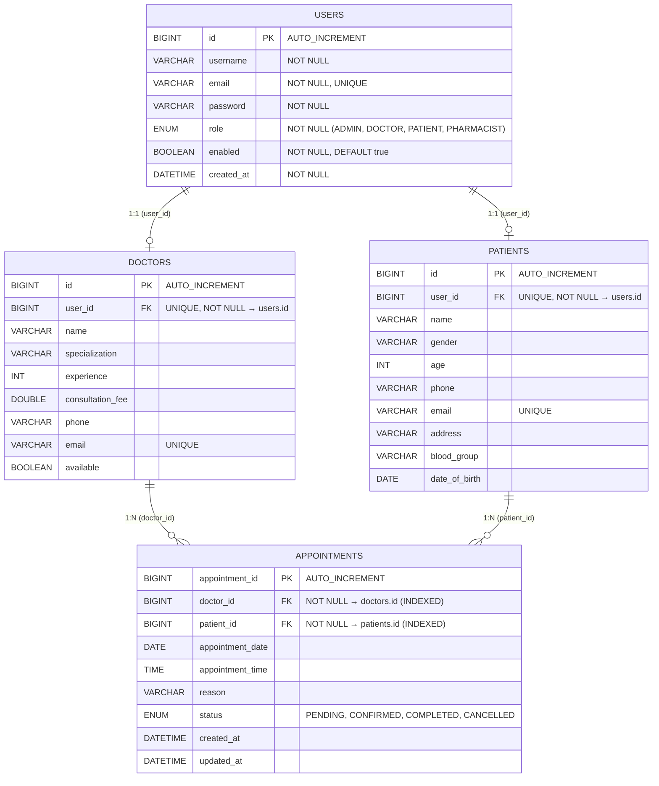

### Primary Key — Foreign Key Relationships

| FK Column | Source Table | → | Target Table | Target Column | Relationship | Constraint Type |
|-----------|-------------|---|--------------|---------------|-------------|-----------------|
| `user_id` | `doctors` | → | `users` | `id` | One-to-One | `UNIQUE`, `NOT NULL` |
| `user_id` | `patients` | → | `users` | `id` | One-to-One | `UNIQUE`, `NOT NULL` |
| `doctor_id` | `appointments` | → | `doctors` | `id` | Many-to-One | `NOT NULL`, `INDEXED` |
| `patient_id` | `appointments` | → | `patients` | `id` | Many-to-One | `NOT NULL`, `INDEXED` |

### Relationship Semantics

```
users (1) ──────── (0..1) doctors      A user with role DOCTOR has exactly one doctor profile
users (1) ──────── (0..1) patients     A user with role PATIENT has exactly one patient record
doctors (1) ────── (0..N) appointments A doctor can have zero or many appointments
patients (1) ───── (0..N) appointments A patient can book zero or many appointments
```

> **Important**: These are **logical foreign keys** — the column constraints (`NOT NULL`, `UNIQUE`, `INDEXED`) are enforced at the database level via JPA `@Column` annotations. However, because each entity lives in a separate microservice JPA context, `@ManyToOne` / `@JoinColumn` physical FK annotations are not used. Referential integrity is maintained through application-level validation and the registration workflow.

### Database Indexes

| Index Name | Table | Column(s) | Purpose |
|------------|-------|-----------|---------|
| `PRIMARY` | All tables | `id` / `appointment_id` | Primary key lookup |
| `UK_user_id` | `doctors`, `patients` | `user_id` | Ensures 1:1 mapping with users |
| `UK_email` | `doctors`, `patients`, `users` | `email` | Prevents duplicate registrations |
| `idx_appointment_doctor_id` | `appointments` | `doctor_id` | Fast lookup of appointments by doctor |
| `idx_appointment_patient_id` | `appointments` | `patient_id` | Fast lookup of appointments by patient |

---

## 🔗 API Workings — Request Lifecycle

### How a Request Flows Through the System

Every API call from the frontend or Postman follows this lifecycle:

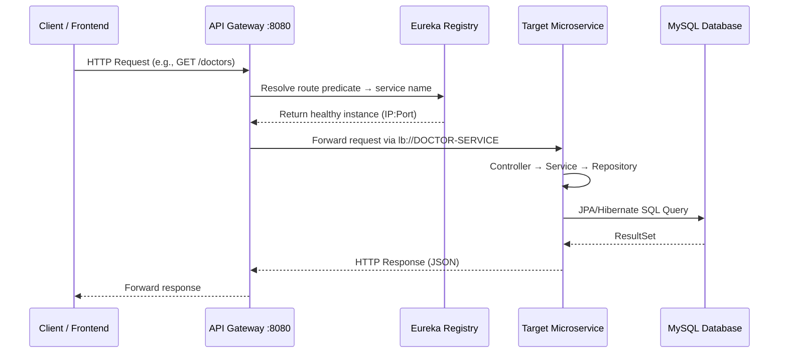

### Detailed Request Processing (Within a Microservice)

```
HTTP Request
    │
    ▼
┌─────────────────────────────────────────────────┐
│  1. CONTROLLER LAYER                            │
│     • @RestController receives the request      │
│     • Extracts @PathVariable, @RequestBody      │
│     • Delegates to Service layer                │
│     • Returns ResponseEntity<T>                 │
└───────────────────┬─────────────────────────────┘
                    │
                    ▼
┌─────────────────────────────────────────────────┐
│  2. SERVICE LAYER                               │
│     • Business logic and validation             │
│     • Entity ↔ DTO conversion (via Mapper)      │
│     • Orchestrates Repository calls             │
│     • Handles exceptions                        │
└───────────────────┬─────────────────────────────┘
                    │
                    ▼
┌─────────────────────────────────────────────────┐
│  3. REPOSITORY LAYER                            │
│     • Extends JpaRepository<Entity, Long>       │
│     • Spring Data auto-generates CRUD queries   │
│     • Custom queries via method naming          │
│       (findByEmail, existsByEmail, findByUserId)│
└───────────────────┬─────────────────────────────┘
                    │
                    ▼
┌─────────────────────────────────────────────────┐
│  4. DATABASE LAYER                              │
│     • Hibernate translates to SQL               │
│     • Executes against MySQL                    │
│     • Returns mapped Entity objects             │
└─────────────────────────────────────────────────┘
```

### Example: Booking an Appointment (Full Lifecycle)

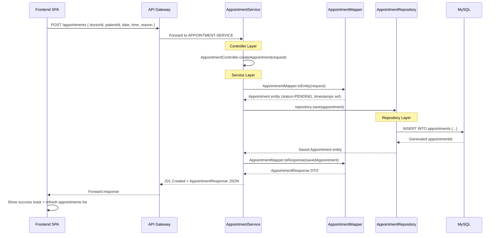

### Error Handling Flow

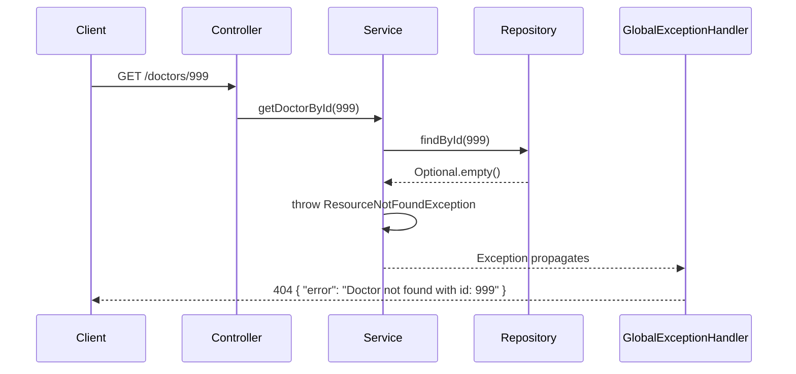

---

## 🔌 Database Connection Strategy

### Shared Database Architecture

All four microservices connect to a **single shared MySQL database**: `hospital_management_system`. This is a pragmatic architectural choice that simplifies cross-service queries and enables logical foreign key relationships.

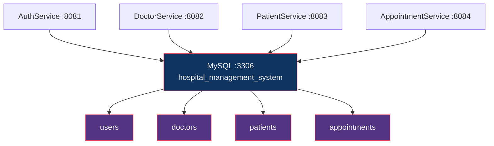

### Connection Configuration

All services share an identical database connection configuration:

| Property | Value | Description |
|----------|-------|-------------|
| `spring.datasource.url` | `jdbc:mysql://localhost:3306/hospital_management_system` | JDBC connection URL |
| `spring.datasource.username` | `${DB_USERNAME}` | From environment variable |
| `spring.datasource.password` | `${DB_PASSWORD}` | From environment variable |
| `spring.datasource.driver-class-name` | `com.mysql.cj.jdbc.Driver` | MySQL Connector/J driver |
| `spring.jpa.hibernate.ddl-auto` | `update` | Auto-creates/alters tables on startup |
| `spring.jpa.show-sql` | `true` | Logs generated SQL (for development) |
| `spring.jpa.properties.hibernate.format_sql` | `true` | Pretty-prints SQL in logs |

### Hibernate DDL Auto Strategy

The `spring.jpa.hibernate.ddl-auto=update` strategy means:

- **On first startup**: Hibernate scans all `@Entity` classes and **creates** the corresponding tables if they don't exist
- **On subsequent startups**: Hibernate **compares** entity definitions with existing tables and **alters** them (adds new columns, indexes) — it never drops columns or tables
- **Schema ownership**: Each service only manages the tables for its own entities:

| Service | Manages Table(s) | Entity Classes |
|---------|------------------|----------------|
| AuthService | `users` | `User` |
| DoctorService | `doctors` | `Doctor` |
| PatientService | `patients` | `Patient` |
| AppointmentService | `appointments` | `Appointment` |

### Environment Variables

Database credentials are externalized via environment variables for security:

```bash
# Linux / Mac
export DB_USERNAME=root
export DB_PASSWORD=your_mysql_password

# Windows (Command Prompt)
set DB_USERNAME=root
set DB_PASSWORD=your_mysql_password

# Windows (PowerShell)
$env:DB_USERNAME="root"
$env:DB_PASSWORD="your_mysql_password"
```

> **Security Note**: Never hardcode database passwords in `application.properties`. The `${DB_USERNAME}` and `${DB_PASSWORD}` placeholders are resolved from OS environment variables at runtime.

### Service Discovery Configuration

All services register with Eureka using the following configuration:

| Property | Value | Purpose |
|----------|-------|---------|
| `eureka.client.service-url.defaultZone` | `http://localhost:8761/eureka` | Eureka server endpoint |
| `eureka.instance.prefer-ip-address` | `true` | Register with IP instead of hostname (avoids DNS issues) |

---

## 🚀 Getting Started

### Prerequisites

- **Java 17** or higher
- **Maven** (or use the included `mvnw` wrapper)
- **MySQL** running on `localhost:3306`

### 1. Setup Database

```sql
CREATE DATABASE hospital_management_system;
```

### 2. Set Environment Variables

```bash
# Linux / Mac
export DB_USERNAME=root
export DB_PASSWORD=your_mysql_password

# Windows (Command Prompt)
set DB_USERNAME=root
set DB_PASSWORD=your_mysql_password

# Windows (PowerShell)
$env:DB_USERNAME="root"
$env:DB_PASSWORD="your_mysql_password"
```

### 3. Start Services (in order)

> ⚠️ **Start in this exact order.** Eureka must be running before other services can register.

```bash
# Terminal 1 — Eureka Server (start first, wait until ready)
cd eureka
./mvnw spring-boot:run

# Terminal 2 — Auth Service
cd AuthService
./mvnw spring-boot:run

# Terminal 3 — Doctor Service
cd DoctorServices
./mvnw spring-boot:run

# Terminal 4 — Patient Service
cd PatientServices
./mvnw spring-boot:run

# Terminal 5 — Appointment Service
cd AppointmentService
./mvnw spring-boot:run

# Terminal 6 — API Gateway (start last)
cd ApiGateway
./mvnw spring-boot:run

# Terminal 7 — Frontend Application
# Double-click frontend/index.html to open in your browser, or serve it:
npx serve frontend
```

### 4. Verify

- **Eureka Dashboard**: http://localhost:8761 — all services should show as `UP`
- **API Gateway**: http://localhost:8080 — single entry point for all APIs
- **Frontend Portal**: Open `frontend/index.html` in your browser (or at `http://localhost:3000` if using a local server like `serve`)

---

## 📖 Swagger UI (API Documentation)

Each service has interactive API docs:

| Service | Swagger URL |
|---------|-------------|
| AuthService | http://localhost:8081/swagger-ui.html |
| DoctorService | http://localhost:8082/swagger-ui.html |
| PatientService | http://localhost:8083/swagger-ui.html |

> **Note**: AuthService Swagger may show a security popup — just click **Cancel** to dismiss it. The public endpoints (`/auth/register`, `/auth/login`) work without authentication.

---

## 🔄 End-to-End System Workflow

The Hospital Management System operates through a synchronized workflow between the Frontend UI Portal, the API Gateway, and the microservices database layer.

### 🗺️ Unified Workflow Diagram

```
[Patient / Doctor]
      │
      ├─ 1. Register Account (index.html) ──▶ AuthService (Port 8081)
      │                                            │
      │                                            ├─ Save Auth Account (Auth DB)
      │                                            └─ REST Post (Eureka) ──▶ [Doctor/Patient Service]
      │                                                                           └─ Initialize Profile
      │
      ├─ 2. Log In & Fetch Token (index.html) ──▶ AuthService (Port 8081)
      │                                                 └─ Returns JWT Token
      │
      ├─ 3. Complete Profile Details (index.html) ──▶ [Doctor/Patient Service] (PUT update)
      │
      ├─ 4. Book Appointment (Patient) ──▶ AppointmentService (Port 8084) (Creates PENDING)
      │
      └─ 5. Review & Confirm (Doctor) ──▶ AppointmentService (Port 8084) (Updates to CONFIRMED/COMPLETED)
```

---

### 1. User Onboarding & Automated Service Sync

When a new user signs up in the frontend portal, the client sends a registration request containing the user's role (`DOCTOR` or `PATIENT`).

1. The client submits `POST /auth/register` to the API Gateway.
2. The Gateway routes the request to the `AuthService`.
3. The `AuthService` hashes the password and saves the account in the `users` table.
4. Using a load-balanced `RestClient` over Eureka, the `AuthService` calls the respective service (`DoctorService` or `PatientService`) to create a stub profile linked by `userId`.
5. The frontend handles the response, displays a toast, and guides the user to the login screen.

**REST Equivalent**:
```bash
curl -X POST http://localhost:8080/auth/register \
  -H "Content-Type: application/json" \
  -d '{
    "username": "Dr. Smith",
    "email": "drsmith@hospital.com",
    "password": "password123",
    "role": "DOCTOR"
  }'
```
**Response**: `DOCTOR Registered Successfully`

---

### 2. Login & JWT Session Retrieval

The user enters their email and password to log in.

1. The client submits `POST /auth/login` to the Gateway.
2. `AuthService` validates the credentials and responds with a JWT token (24-hour expiration).
3. The frontend captures the token, saves it to `localStorage` under `hms_token`, decodes it to set up user state, and mounts the application dashboard layout.

**REST Equivalent**:
```bash
curl -X POST http://localhost:8080/auth/login \
  -H "Content-Type: application/json" \
  -d '{
    "email": "drsmith@hospital.com",
    "password": "password123"
  }'
```
**Response**:
```json
{
  "token": "eyJhbGciOiJIUzI1NiJ9..."
}
```

---

### 3. Profile Completion

The profile initialized during signup contains only basic info (name/email). The user can complete their onboarding in the **My Profile** view.

1. The user fills in missing details (specialization, experience, and fee for doctors; or age, gender, DOB, address, and blood group for patients).
2. The client sends a `PUT` request containing the updated fields to `/doctors/{id}` or `/patients/{id}` through the Gateway.
3. The target database updates the record, and the frontend updates its internal `myProfile` cache.

**REST Equivalent (Doctor Update)**:
```bash
curl -X PUT http://localhost:8080/doctors/1 \
  -H "Content-Type: application/json" \
  -d '{
    "name": "Dr. Smith",
    "specialization": "Cardiology",
    "experience": 12,
    "consultationFee": 500.00,
    "phone": "9876543210",
    "email": "drsmith@hospital.com",
    "available": true
  }'
```

---

### 4. Appointment Booking (Patient Flow)

Patients can search for available doctors and book visits.

1. The client fetches all doctors via `GET /doctors` and displays only those with `available: true`.
2. The patient fills in the date, time, and reason, and books the appointment.
3. The client submits `POST /appointments` to the `AppointmentService`.
4. The database stores the booking in a `PENDING` state, which instantly shows up on both the patient's and doctor's dashboards.

**REST Equivalent**:
```bash
curl -X POST http://localhost:8080/appointments \
  -H "Content-Type: application/json" \
  -d '{
    "doctorId": 1,
    "patientId": 1,
    "appointmentDate": "2026-07-15",
    "appointmentTime": "10:30:00",
    "reason": "Routine checkup"
  }'
```

---

### 5. Appointment Review & Actions (Doctor Flow)

Doctors can manage bookings assigned to them from the **My Appointments** dashboard.

1. The doctor views all appointments where `doctorId` matches their profile ID.
2. The doctor can invoke the following status changes:
   - **Accept**: Changes status to `CONFIRMED` (`PUT /appointments/{id}/status?status=CONFIRMED`).
   - **Complete**: Changes status to `COMPLETED` (`PUT /appointments/{id}/status?status=COMPLETED`).
   - **Cancel**: Changes status to `CANCELLED` (`PUT /appointments/{id}/status?status=CANCELLED`).
3. The client updates the appointment table in real-time.

**REST Equivalent (Confirming Status)**:
```bash
curl -X PUT http://localhost:8080/appointments/1/status?status=CONFIRMED \
  -H "Authorization: Bearer <token>"
```

---

## 🗂️ Project Structure

```
Hospital_Management_System/
├── eureka/                          # Eureka Service Registry
│   └── src/main/java/.../EurekaApplication.java
│
├── ApiGateway/                      # API Gateway
│   └── src/main/java/.../ApiGatewayApplication.java
│
├── AuthService/                     # Authentication Service
│   └── src/main/java/com/hospital/auth/
│       ├── config/
│       │   ├── SecurityConfig.java        # HTTP security, JWT filter, BCrypt
│       │   └── RestClientConfig.java      # Load-balanced RestClient for inter-service calls
│       ├── controller/AuthController.java
│       ├── dto/
│       │   ├── AuthResponse.java
│       │   ├── LoginRequest.java
│       │   └── RegisterRequest.java
│       ├── entity/
│       │   ├── User.java                  # PK: id | Maps to `users` table
│       │   └── Role.java                  # Enum: ADMIN, DOCTOR, PATIENT, PHARMACIST
│       ├── exception/GlobalExceptionHandler.java
│       ├── repository/UserRepository.java
│       ├── security/JwtAuthenticationFilter.java
│       ├── service/
│       │   ├── AuthService.java           # Calls Doctor/Patient services on registration
│       │   └── CustomUserDetailsService.java
│       └── util/JwtUtil.java
│
├── DoctorServices/                  # Doctor Management Service
│   └── src/main/java/com/example/demo/
│       ├── controller/DoctorController.java  # Includes POST /doctors/register
│       ├── dto/DoctorRegisterRequest.java    # DTO for registration
│       ├── entity/Doctor.java                # PK: id | FK: userId → users.id
│       ├── exception/
│       │   ├── ResourceNotFoundException.java
│       │   └── GlobalExceptionHandler.java
│       ├── repo/DoctorRepository.java
│       └── service/
│           ├── DoctorService.java
│           └── DoctorServiceImpl.java
│
├── PatientServices/                 # Patient Management Service
│   └── src/main/java/com/example/demo/
│       ├── controller/PatientController.java  # Includes POST /patients/register
│       ├── dto/PatientRegisterRequest.java    # DTO for registration
│       ├── entity/Patient.java                # PK: id | FK: userId → users.id
│       ├── exception/
│       │   ├── ResourceNotFoundException.java
│       │   └── GlobalExceptionHandler.java
│       ├── repo/PatientRepository.java
│       └── service/
│           ├── PatientService.java
│           └── PatientServiceImpl.java
│
├── AppointmentService/              # Appointment Booking Service
│   └── src/main/java/com/shaan/appointmentservice/
│       ├── client/
│       │   ├── DoctorClient.java              # Feign → DOCTOR-SERVICE
│       │   └── PatientClient.java             # Feign → PATIENT-SERVICE
│       ├── controller/AppointmentController.java
│       ├── dto/
│       │   ├── AppointmentRequest.java
│       │   ├── AppointmentResponse.java
│       │   ├── DoctorDTO.java
│       │   └── PatientDTO.java
│       ├── entity/Appointment.java            # PK: appointmentId | FK: doctorId → doctors.id, patientId → patients.id
│       ├── enums/AppointmentStatus.java       # PENDING, CONFIRMED, COMPLETED, CANCELLED
│       ├── mapper/AppointmentMapper.java
│       └── service/
│           ├── AppointmentService.java
│           └── AppointmentServiceImpl.java
│
└── frontend/                        # Frontend Application (Portal UI)
    └── index.html                   # Single Page Application (HTML/CSS/JS)
```

---

## ⚙️ Port Summary

| Service | Port | Eureka Name |
|---------|------|-------------|
| Eureka Server | 8761 | — |
| API Gateway | 8080 | API-GATEWAY |
| AuthService | 8081 | AUTH-SERVICE |
| DoctorService | 8082 | DOCTOR-SERVICE |
| PatientService | 8083 | PATIENT-SERVICE |
| AppointmentService | 8084 | APPOINTMENT-SERVICE |
| MySQL | 3306 | — |

---

## 🤝 Contributing

1. Fork the repository
2. Create your feature branch (`git checkout -b feature/my-feature`)
3. Commit your changes (`git commit -m 'Add my feature'`)
4. Push to the branch (`git push origin feature/my-feature`)
5. Open a Pull Request
